# Диаграммы вариантов использования (Use Case Diagrams)

## Обзор

Данный документ содержит диаграммы вариантов использования (use case diagrams) для системы парсинга статей, описывающие взаимодействие различных акторов с системой.

## Акторы (Actors)

1. **Администратор системы** - управляет конфигурацией и источниками
2. **Разработчик** - интегрирует систему в другие приложения через API
3. **Планировщик (Scheduler)** - автоматизированный компонент для периодического парсинга
4. **Конечный пользователь** - использует CLI или API для получения статей

## 1. Общая диаграмма use-case

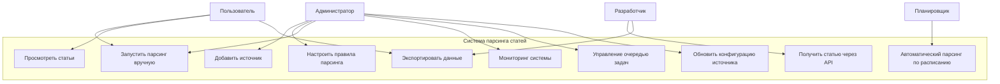

## 2. Детальные Use Cases

### UC-01: Добавить источник

**Актор**: Администратор

**Предусловия**:
- Администратор аутентифицирован в системе
- Источник еще не добавлен

**Основной поток**:
1. Администратор выбирает "Добавить источник"
2. Система запрашивает данные источника (имя, домен, URL)
3. Администратор вводит данные источника
4. Система валидирует данные
5. Система создает конфигурацию по умолчанию
6. Система сохраняет источник
7. Система подтверждает успешное добавление

**Альтернативные потоки**:
- 4a. Данные невалидны
  - Система показывает ошибку валидации
  - Возврат к шагу 3
- 4b. Источник уже существует
  - Система показывает предупреждение
  - Предлагает обновить существующий источник

**Постусловия**: Новый источник добавлен в систему и готов к настройке

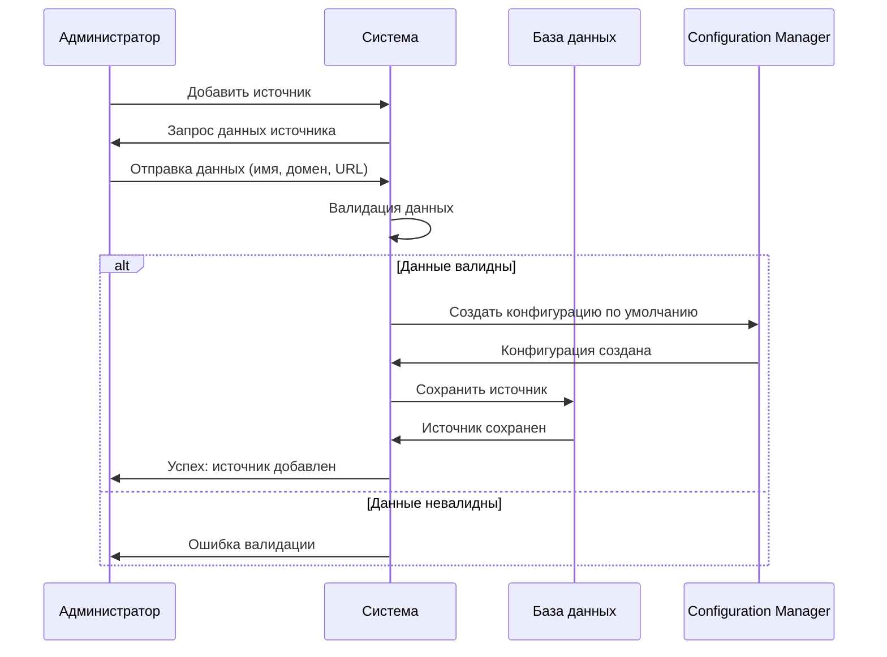

### UC-02: Настроить правила парсинга

**Актор**: Администратор

**Предусловия**:
- Источник существует в системе
- Администратор имеет права на изменение конфигурации

**Основной поток**:
1. Администратор выбирает источник для настройки
2. Система показывает текущую конфигурацию
3. Администратор редактирует правила парсинга (селекторы)
4. Администратор может протестировать правила на примере
5. Система валидирует конфигурацию
6. Система сохраняет обновленную конфигурацию
7. Система подтверждает сохранение

**Альтернативные потоки**:
- 5a. Конфигурация невалидна
  - Система показывает ошибки
  - Возврат к шагу 3
- 4a. Тест правил
  - Администратор вводит URL для теста
  - Система парсит страницу с новыми правилами
  - Система показывает результат

**Постусловия**: Правила парсинга обновлены

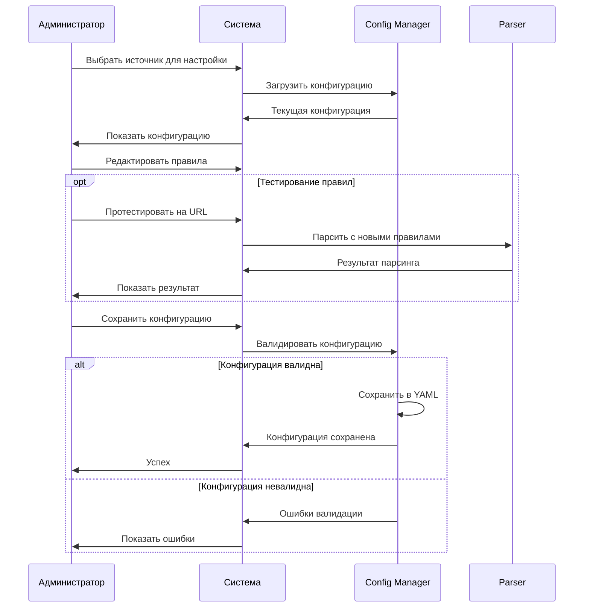

### UC-03: Запустить парсинг вручную

**Актор**: Администратор или Пользователь

**Предусловия**:
- Источник существует и активен
- Система работает

**Основной поток**:
1. Актор выбирает источник или URL для парсинга
2. Система создает задачу парсинга
3. Система добавляет задачу в очередь
4. Воркер обрабатывает задачу
5. Система парсит страницу
6. Система сохраняет результат
7. Система уведомляет о завершении

**Альтернативные потоки**:
- 5a. Ошибка парсинга
  - Система логирует ошибку
  - Система помечает задачу как failed
  - Система уведомляет об ошибке
- 5b. Страница недоступна
  - Система применяет retry механизм
  - Если retry не помог - пометить как failed

**Постусловия**: Статья извлечена и сохранена или ошибка залогирована

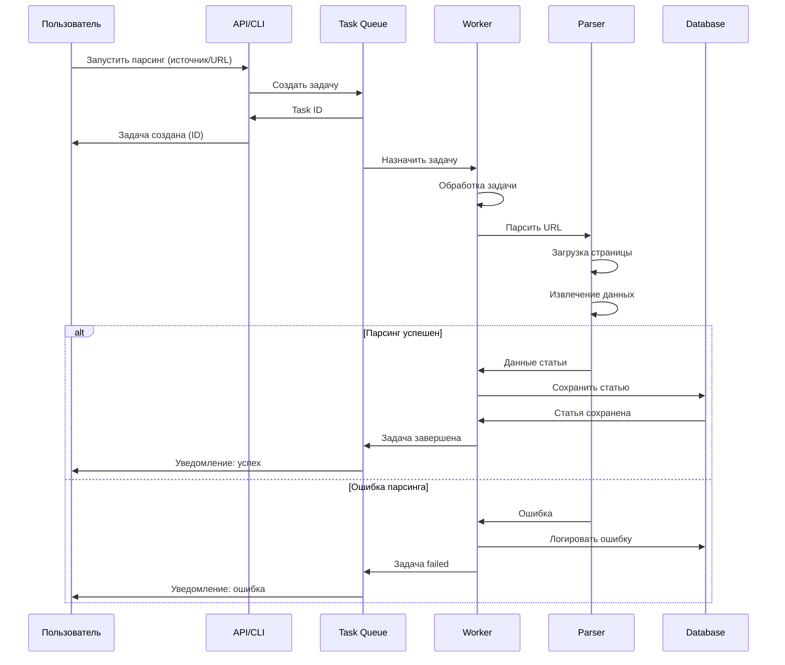

### UC-04: Просмотреть статьи

**Актор**: Пользователь

**Предусловия**: В системе есть сохраненные статьи

**Основной поток**:
1. Пользователь запрашивает список статей
2. Система возвращает список с фильтрацией/сортировкой
3. Пользователь выбирает статью
4. Система показывает детали статьи

**Альтернативные потоки**:
- 2a. Применение фильтров
  - По источнику
  - По дате
  - По тегам
  - По языку
- 2b. Применение сортировки
  - По дате публикации
  - По дате парсинга
  - По заголовку

**Постусловия**: Пользователь получил информацию о статьях

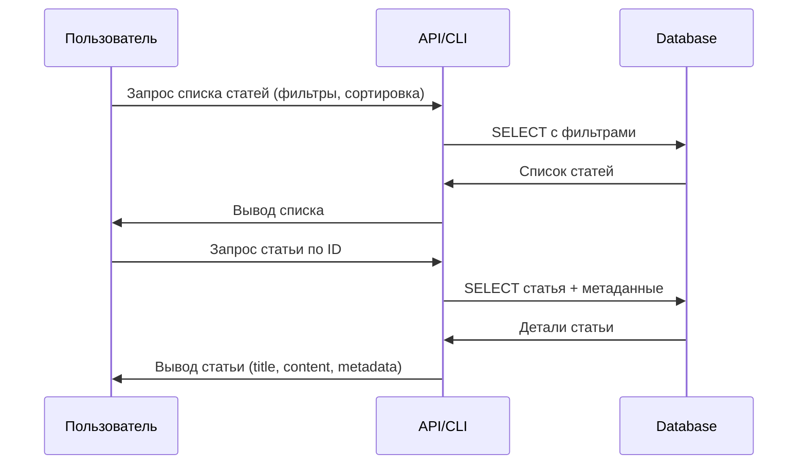

### UC-05: Экспортировать данные

**Актор**: Пользователь или Разработчик

**Предусловия**: В системе есть данные для экспорта

**Основной поток**:
1. Актор выбирает данные для экспорта (фильтры)
2. Актор выбирает формат экспорта (JSON, CSV, Markdown)
3. Система генерирует файл экспорта
4. Система предоставляет файл для скачивания

**Альтернативные потоки**:
- 3a. Большой объем данных
  - Система создает фоновую задачу
  - Система уведомляет при готовности
- 2a. Форматы экспорта
  - JSON: Полные данные
  - CSV: Табличное представление
  - Markdown: Текст статей

**Постусловия**: Данные экспортированы в выбранном формате

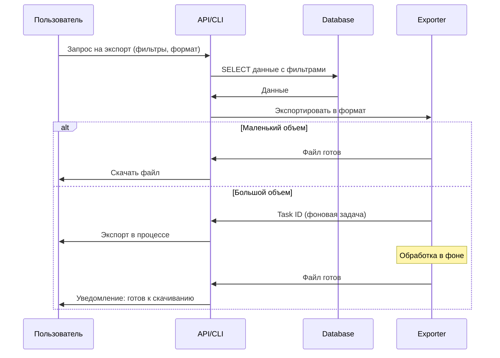

### UC-06: Автоматический парсинг по расписанию

**Актор**: Планировщик (Scheduler)

**Предусловия**:
- Источники настроены с расписанием
- Система работает

**Основной поток**:
1. Планировщик проверяет расписание
2. Планировщик определяет источники для парсинга
3. Планировщик создает задачи парсинга
4. Задачи добавляются в очередь
5. Воркеры обрабатывают задачи
6. Система сохраняет результаты

**Альтернативные потоки**:
- 2a. Нет источников для парсинга
  - Планировщик ждет следующего интервала
- 5a. Превышен лимит ошибок для источника
  - Планировщик деактивирует источник
  - Система отправляет алерт администратору

**Постусловия**: Новые статьи парсятся автоматически

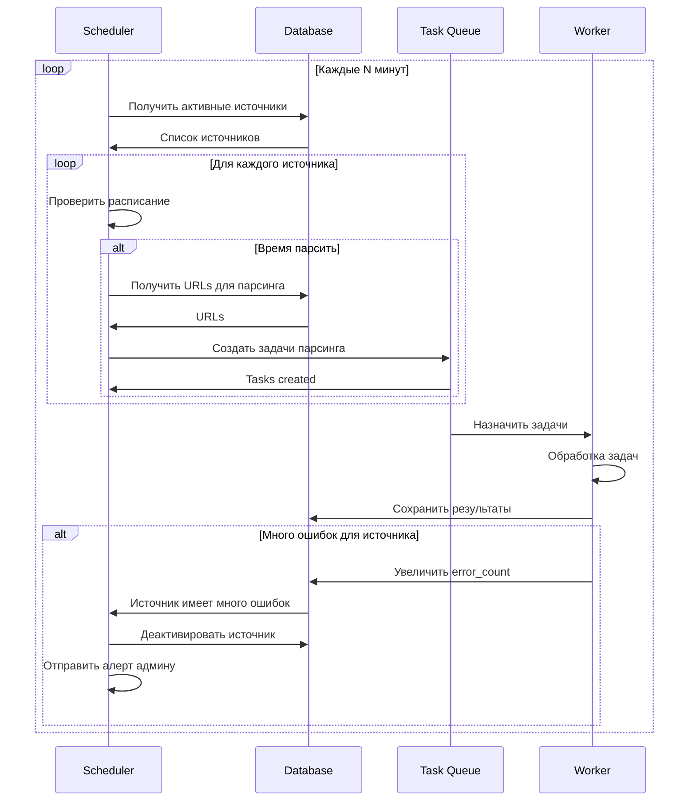

### UC-07: Получить статью через API

**Актор**: Разработчик (внешнее приложение)

**Предусловия**:
- API доступен
- Разработчик имеет API ключ (если требуется аутентификация)

**Основной поток**:
1. Приложение отправляет GET запрос к API
2. API валидирует запрос (аутентификация, параметры)
3. API запрашивает данные из базы
4. API формирует JSON ответ
5. API возвращает данные приложению

**Альтернативные потоки**:
- 2a. Невалидный API ключ
  - Вернуть 401 Unauthorized
- 2b. Превышен rate limit
  - Вернуть 429 Too Many Requests
- 3a. Статья не найдена
  - Вернуть 404 Not Found

**Постусловия**: Приложение получило данные или ошибку

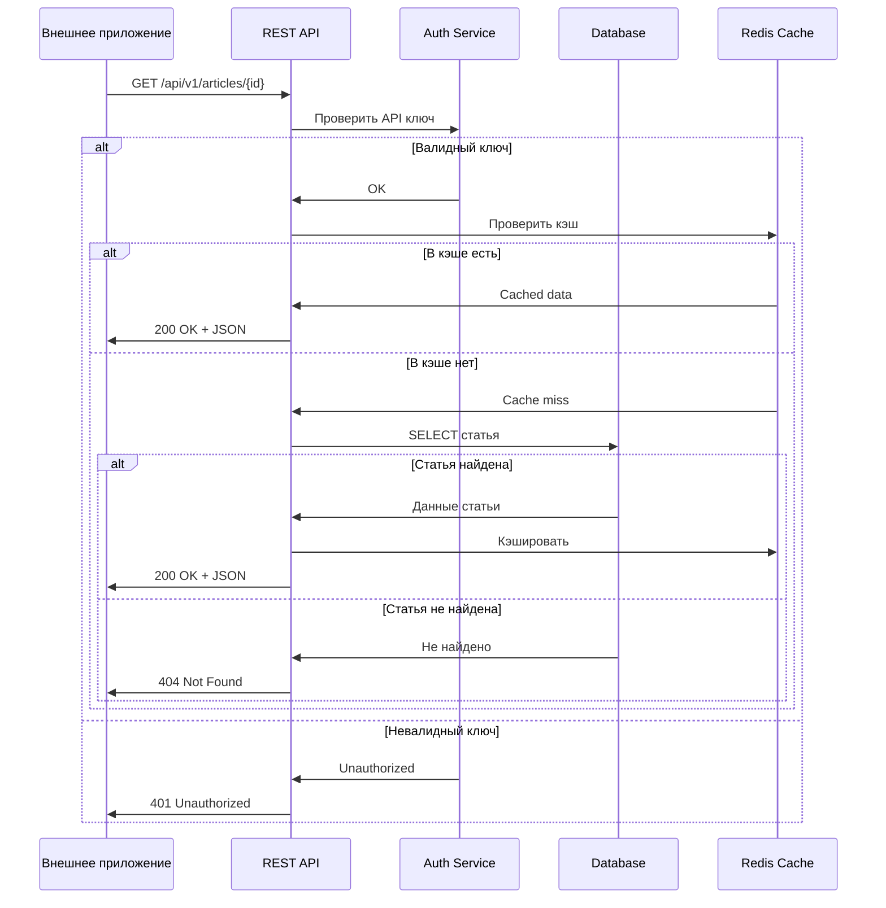

### UC-08: Мониторинг системы

**Актор**: Администратор

**Предусловия**: Система мониторинга настроена

**Основной поток**:
1. Администратор открывает dashboard мониторинга
2. Система показывает метрики:
   - Количество активных воркеров
   - Размер очереди задач
   - Статистика парсинга (успех/ошибки)
   - Производительность (статей/час)
   - Использование ресурсов
3. Администратор может просмотреть детали
4. Администратор может настроить алерты

**Альтернативные потоки**:
- 3a. Обнаружена проблема
  - Администратор просматривает логи
  - Администратор принимает меры (restart, изменение конфигурации)

**Постусловия**: Администратор знает состояние системы

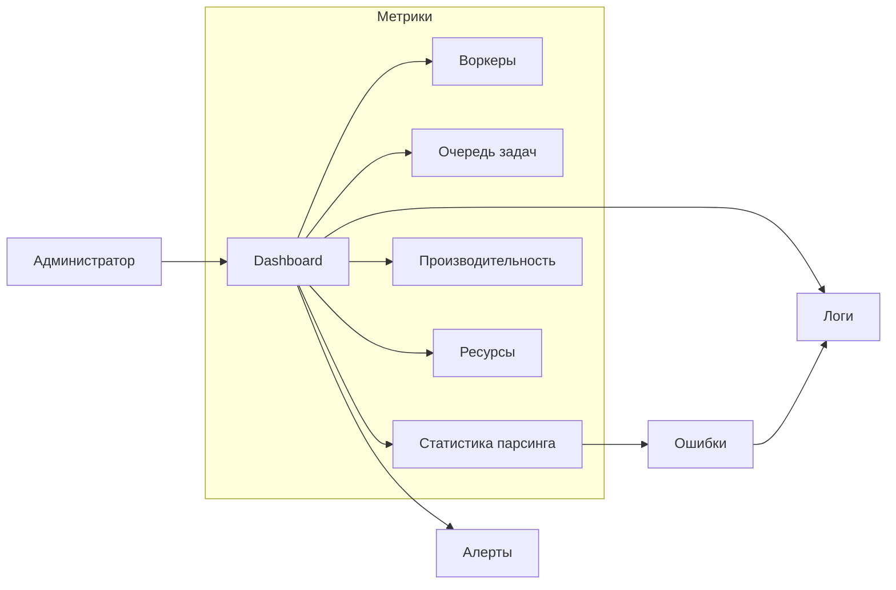

### UC-09: Управление очередью задач

**Актор**: Администратор

**Предусловия**: Система работает

**Основной поток**:
1. Администратор просматривает очередь задач
2. Администратор может:
   - Изменить приоритет задачи
   - Отменить задачу
   - Перезапустить failed задачу
   - Очистить очередь
3. Система применяет изменения

**Альтернативные потоки**:
- 2a. Задача уже выполняется
  - Показать предупреждение
  - Разрешить отмену с остановкой воркера

**Постусловия**: Очередь задач управляется вручную

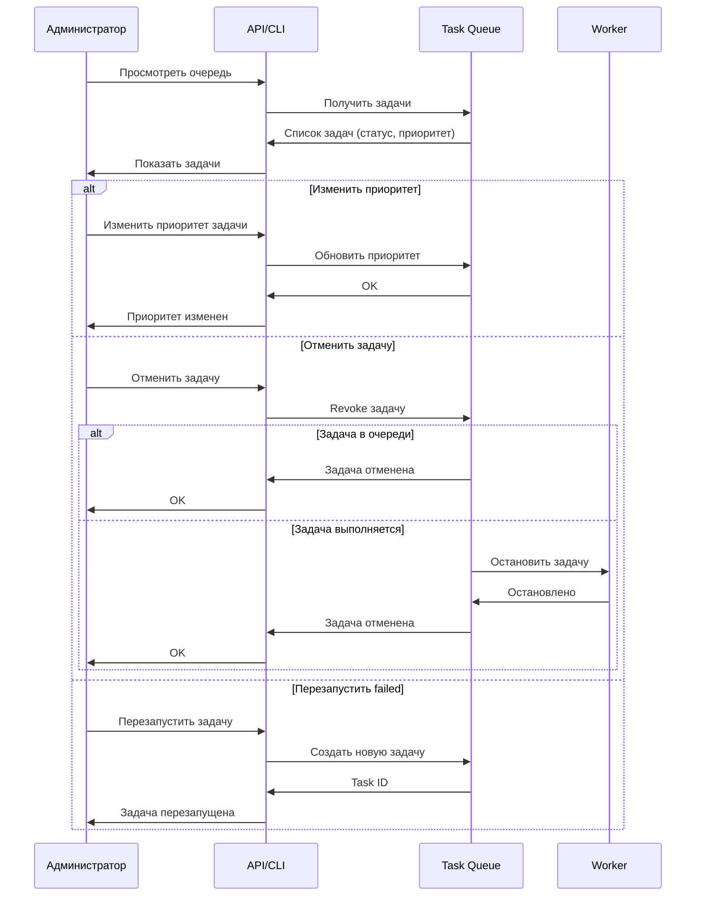

### UC-10: Обновить конфигурацию источника

**Актор**: Администратор

**Предусловия**: Источник существует в системе

**Основной поток**:
1. Администратор выбирает источник
2. Система показывает текущие настройки
3. Администратор изменяет настройки:
   - Активность (включить/выключить)
   - Частота парсинга
   - Приоритет
   - Rate limiting
4. Система валидирует изменения
5. Система сохраняет обновления
6. Система применяет изменения к планировщику

**Постусловия**: Конфигурация источника обновлена

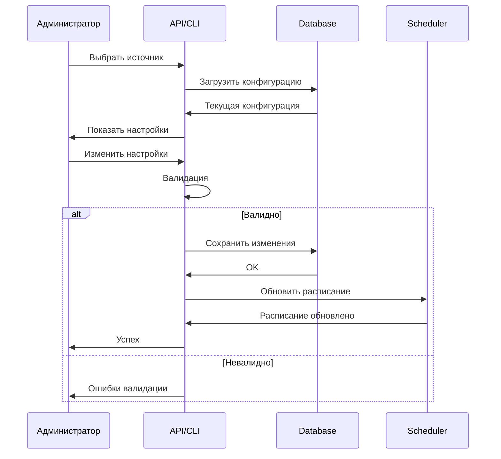

## 3. Use Case со связями (Include & Extend)

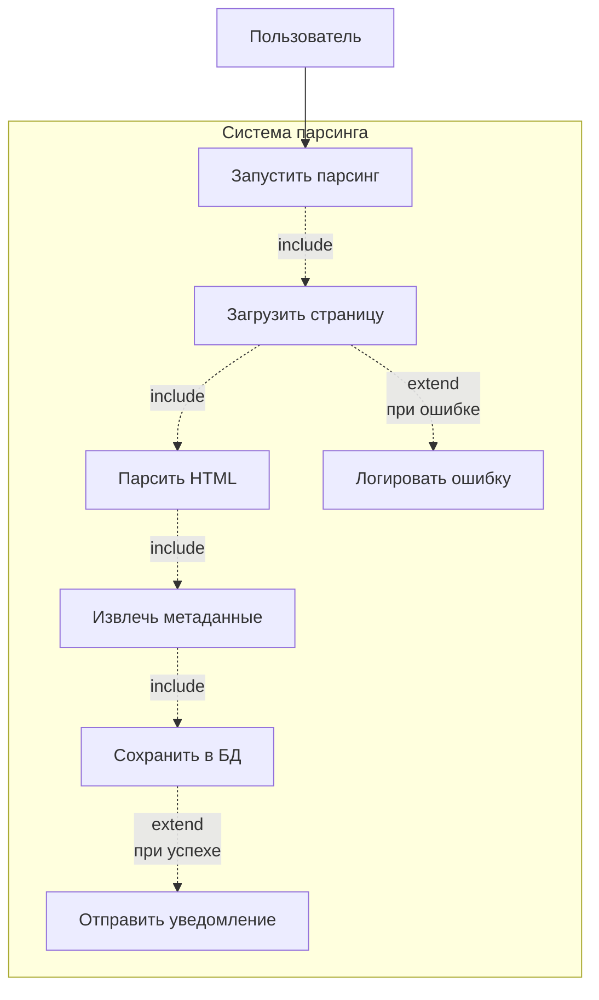

**Легенда**:
- `include` - обязательное включение (всегда выполняется)
- `extend` - опциональное расширение (выполняется при условии)

## 4. Резюме Use Cases

| UC ID | Название | Актор | Приоритет |
|-------|----------|-------|-----------|
| UC-01 | Добавить источник | Администратор | Высокий |
| UC-02 | Настроить правила парсинга | Администратор | Высокий |
| UC-03 | Запустить парсинг вручную | Пользователь/Админ | Высокий |
| UC-04 | Просмотреть статьи | Пользователь | Средний |
| UC-05 | Экспортировать данные | Пользователь/Разработчик | Средний |
| UC-06 | Автоматический парсинг по расписанию | Планировщик | Высокий |
| UC-07 | Получить статью через API | Разработчик | Высокий |
| UC-08 | Мониторинг системы | Администратор | Средний |
| UC-09 | Управление очередью задач | Администратор | Низкий |
| UC-10 | Обновить конфигурацию источника | Администратор | Средний |

## 5. Взаимодействие Use Cases

Некоторые use cases взаимодействуют друг с другом:

- **UC-01** (Добавить источник) → **UC-02** (Настроить правила) → **UC-03** (Запустить парсинг)
- **UC-06** (Автоматический парсинг) включает в себя **UC-03** (Запустить парсинг)
- **UC-08** (Мониторинг) может привести к **UC-09** (Управление очередью)
- **UC-10** (Обновить конфигурацию) может привести к **UC-02** (Настроить правила)

---

**Версия**: 1.0
**Дата**: 2025-11-01
**Статус**: Draft
