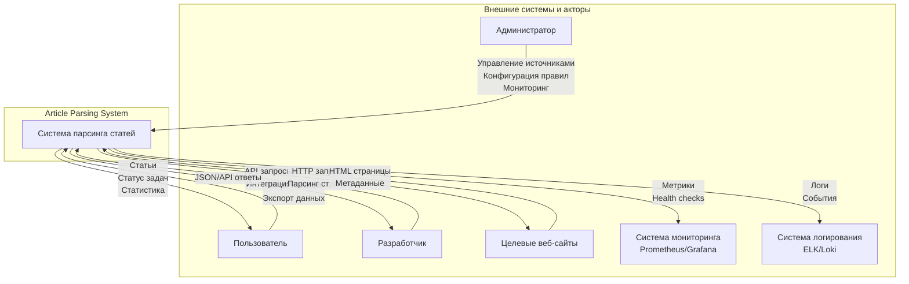
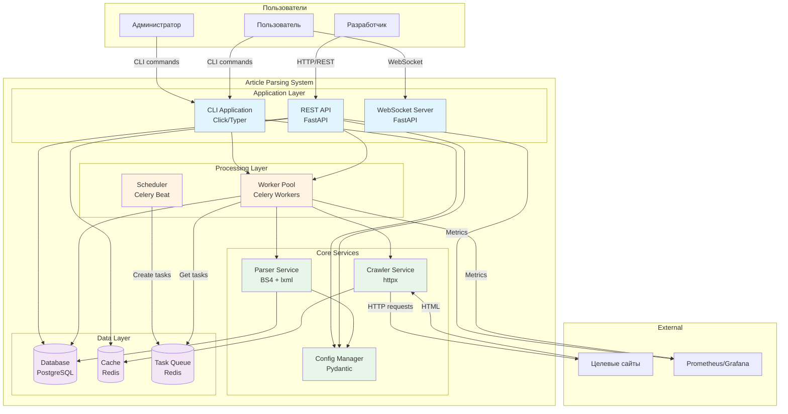
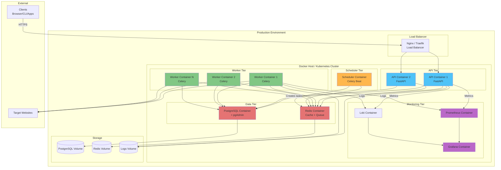
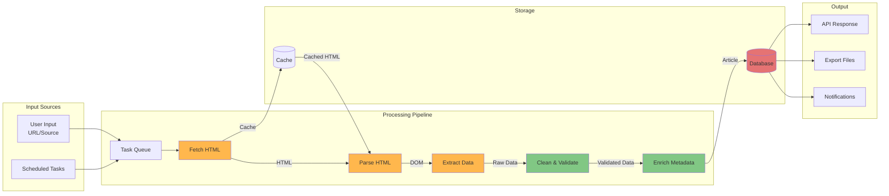
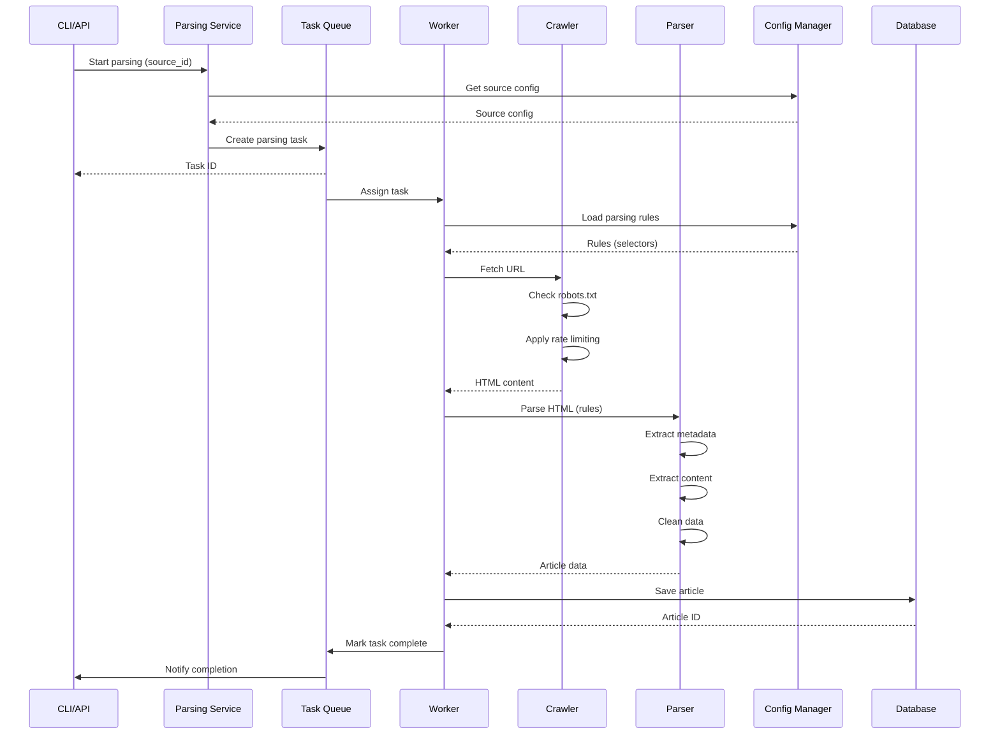

# Архитектурные диаграммы

## Обзор

Данный документ содержит контекстные и компонентные диаграммы системы парсинга статей, визуализирующие архитектуру на различных уровнях абстракции.

## 1. Контекстная диаграмма (Context Diagram)

Контекстная диаграмма показывает систему как единое целое и её взаимодействие с внешними сущностями.

### Описание взаимодействий

**Входящие потоки**:
- **От Администратора**: Команды управления, конфигурации, запросы на парсинг
- **От Пользователя**: Запросы на просмотр/экспорт статей, запуск парсинга
- **От Разработчика**: REST API запросы для интеграции
- **От веб-сайтов**: HTML контент, метаданные, ошибки HTTP

**Исходящие потоки**:
- **К веб-сайтам**: HTTP/HTTPS запросы на загрузку страниц
- **К пользователям**: Статьи, результаты, уведомления
- **К разработчикам**: JSON ответы через API
- **К системе мониторинга**: Метрики производительности, health статус
- **К системе логирования**: Структурированные логи, события, ошибки

## 2. Контейнерная диаграмма (Container Diagram)

Показывает основные контейнеры (приложения, хранилища) системы и их взаимодействие.

### Описание контейнеров

#### Application Layer (Прикладной слой)

**CLI Application**:
- Технология: Click/Typer
- Порт: N/A (командная строка)
- Назначение: Интерфейс командной строки для управления системой

**REST API**:
- Технология: FastAPI
- Порт: 8000
- Назначение: HTTP API для внешних интеграций и веб-интерфейса

**WebSocket Server**:
- Технология: FastAPI WebSockets
- Порт: 8000 (тот же что API)
- Назначение: Real-time обновления о статусе парсинга

#### Processing Layer (Слой обработки)

**Scheduler**:
- Технология: Celery Beat
- Назначение: Планирование периодических задач парсинга

**Worker Pool**:
- Технология: Celery Workers
- Количество: Масштабируемо (по умолчанию 4)
- Назначение: Асинхронная обработка задач парсинга

#### Core Services (Основные сервисы)

**Crawler Service**:
- Технология: httpx (async)
- Назначение: Загрузка веб-страниц, управление запросами

**Parser Service**:
- Технология: Beautiful Soup 4 + lxml
- Назначение: Извлечение данных из HTML

**Config Manager**:
- Технология: Pydantic + YAML
- Назначение: Управление конфигурациями источников

#### Data Layer (Слой данных)

**Database**:
- Технология: PostgreSQL 15+
- Порт: 5432
- Назначение: Хранение статей, источников, метаданных

**Cache**:
- Технология: Redis 7+
- Порт: 6379
- Назначение: Кэширование HTTP ответов, robots.txt, rate limiting

**Task Queue**:
- Технология: Redis 7+ (используется Celery)
- Порт: 6379
- Назначение: Очередь задач для Celery

## 3. Компонентная диаграмма (Component Diagram)

Детальное представление внутренней структуры системы.

```mermaid
graph TB
    subgraph "API Layer"
        REST[REST API Controller]
        WS_Handler[WebSocket Handler]
        Auth[Authentication]
        RateLimit[Rate Limiter]
    end

    subgraph "Service Layer"
        ArticleService[Article Service]
        SourceService[Source Service]
        ParsingService[Parsing Service]
        ExportService[Export Service]
    end

    subgraph "Crawler Module"
        HTTPClient[HTTP Client]
        RobotsParser[Robots.txt Parser]
        RequestQueue[Request Queue Manager]
        RetryHandler[Retry Handler]
        ProxyManager[Proxy Manager]
    end

    subgraph "Parser Module"
        HTMLParser[HTML Parser<br/>BS4 + lxml]
        MetadataExtractor[Metadata Extractor<br/>OG, Schema.org]
        ContentExtractor[Content Extractor<br/>Readability]
        SelectorEngine[Selector Engine<br/>CSS, XPath]
        DataCleaner[Data Cleaner]
    end

    subgraph "Configuration Module"
        ConfigLoader[Config Loader<br/>YAML/JSON]
        ConfigValidator[Config Validator<br/>Pydantic]
        ConfigCache[Config Cache]
    end

    subgraph "Storage Module"
        ArticleRepo[Article Repository]
        SourceRepo[Source Repository]
        TaskRepo[Task Repository]
        CacheManager[Cache Manager]
    end

    subgraph "Task Module"
        TaskScheduler[Task Scheduler<br/>Celery Beat]
        TaskWorker[Task Worker<br/>Celery]
        TaskQueue_Mgr[Task Queue Manager]
    end

    subgraph "Monitoring Module"
        Logger[Structured Logger<br/>structlog]
        MetricsCollector[Metrics Collector<br/>Prometheus]
        HealthCheck[Health Check]
    end

    %% API connections
    REST --> Auth
    REST --> RateLimit
    REST --> ArticleService
    REST --> SourceService
    REST --> ParsingService
    REST --> ExportService

    %% Service layer connections
    ArticleService --> ArticleRepo
    ArticleService --> CacheManager
    SourceService --> SourceRepo
    SourceService --> ConfigLoader
    ParsingService --> TaskQueue_Mgr
    ExportService --> ArticleRepo

    %% Crawler connections
    ParsingService --> HTTPClient
    HTTPClient --> RobotsParser
    HTTPClient --> RequestQueue
    HTTPClient --> RetryHandler
    HTTPClient --> ProxyManager

    %% Parser connections
    ParsingService --> HTMLParser
    HTMLParser --> MetadataExtractor
    HTMLParser --> ContentExtractor
    HTMLParser --> SelectorEngine
    ContentExtractor --> DataCleaner

    %% Config connections
    SelectorEngine --> ConfigLoader
    ConfigLoader --> ConfigValidator
    ConfigValidator --> ConfigCache

    %% Task connections
    TaskScheduler --> TaskQueue_Mgr
    TaskQueue_Mgr --> TaskWorker
    TaskWorker --> ParsingService

    %% Monitoring
    HTTPClient --> Logger
    HTMLParser --> Logger
    ParsingService --> MetricsCollector
    REST --> HealthCheck

    style REST fill:#4fc3f7
    style ArticleService fill:#81c784
    style HTTPClient fill:#ffb74d
    style HTMLParser fill:#ffb74d
    style ConfigLoader fill:#ba68c8
    style ArticleRepo fill:#e57373
    style TaskScheduler fill:#ffd54f
    style Logger fill:#90a4ae
```

### Описание компонентов

#### API Layer

**REST API Controller**:
- Обработка HTTP запросов
- Маршрутизация к сервисам
- Валидация входных данных (Pydantic)
- Сериализация ответов

**WebSocket Handler**:
- Управление WebSocket соединениями
- Push-уведомления о статусе задач
- Real-time обновления

**Authentication**:
- JWT или API key аутентификация
- Проверка прав доступа

**Rate Limiter**:
- Ограничение частоты API запросов
- Защита от злоупотреблений

#### Service Layer

**Article Service**:
- Бизнес-логика работы со статьями
- CRUD операции
- Фильтрация и поиск
- Дедупликация

**Source Service**:
- Управление источниками
- CRUD операции для источников
- Валидация доменов
- Статистика по источникам

**Parsing Service**:
- Координация процесса парсинга
- Оркестрация Crawler и Parser модулей
- Обработка результатов
- Управление ошибками

**Export Service**:
- Экспорт данных в различные форматы
- Генерация файлов (JSON, CSV, Markdown)
- Пакетная обработка

#### Crawler Module

**HTTP Client**:
- Асинхронные HTTP запросы (httpx)
- Управление сессиями и cookies
- Custom headers, User-Agent
- HTTP/2 поддержка

**Robots.txt Parser**:
- Загрузка и парсинг robots.txt
- Проверка разрешений для URL
- Кэширование правил

**Request Queue Manager**:
- Управление очередью запросов
- Rate limiting на уровне домена
- Приоритизация запросов

**Retry Handler**:
- Автоматические повторные попытки
- Exponential backoff
- Circuit breaker для проблемных источников

**Proxy Manager**:
- Управление прокси-серверами
- Ротация прокси
- Health check прокси

#### Parser Module

**HTML Parser**:
- Парсинг HTML в DOM (Beautiful Soup + lxml)
- Нормализация HTML
- Обработка encoding

**Metadata Extractor**:
- Извлечение Open Graph tags
- Извлечение Twitter Cards
- Парсинг schema.org (JSON-LD, Microdata)
- Извлечение <meta> тегов

**Content Extractor**:
- Реализация Readability алгоритма
- Определение основного контента
- Scoring элементов DOM
- Удаление шума (ads, menus, footers)

**Selector Engine**:
- Применение CSS селекторов
- Применение XPath селекторов
- Конфигурируемые правила
- Fallback механизмы

**Data Cleaner**:
- Удаление HTML тегов
- Нормализация whitespace
- Удаление script/style
- Конвертация HTML entities

#### Configuration Module

**Config Loader**:
- Загрузка YAML/JSON конфигураций
- Чтение из файлов/environment
- Hot-reload конфигураций

**Config Validator**:
- Валидация через Pydantic схемы
- Проверка селекторов
- Валидация URL patterns

**Config Cache**:
- Кэширование загруженных конфигураций
- Инвалидация при изменениях

#### Storage Module

**Article Repository**:
- CRUD операции для статей
- SQLAlchemy ORM
- Запросы с фильтрацией
- Полнотекстовый поиск

**Source Repository**:
- CRUD для источников
- Управление статусом источников
- Статистика (success/error counts)

**Task Repository**:
- CRUD для задач парсинга
- Отслеживание статуса задач
- История выполнения

**Cache Manager**:
- Абстракция над Redis
- Set/Get операции
- TTL управление
- Invalidation стратегии

#### Task Module

**Task Scheduler (Celery Beat)**:
- Периодические задачи
- Crontab-like расписания
- Динамическое обновление расписаний

**Task Worker (Celery)**:
- Обработка задач из очереди
- Concurrency control
- Task acknowledgment
- Error handling

**Task Queue Manager**:
- Абстракция над Celery
- Создание задач
- Мониторинг очереди
- Приоритизация

#### Monitoring Module

**Structured Logger**:
- JSON-логирование (structlog)
- Контекст (correlation IDs)
- Уровни логирования
- Интеграция с ELK/Loki

**Metrics Collector**:
- Prometheus metrics
- Counters (requests, errors)
- Gauges (queue size, active workers)
- Histograms (latency)

**Health Check**:
- Проверка состояния компонентов
- Database connectivity
- Redis connectivity
- /health endpoint

## 4. Диаграмма развертывания (Deployment Diagram)

Показывает физическое размещение компонентов системы.

### Конфигурация развертывания

#### API Tier
- **Instances**: 2+ (для high availability)
- **Resources**: 1 CPU, 1GB RAM per instance
- **Scaling**: Horizontal (по CPU/Memory)
- **Health check**: /health endpoint

#### Worker Tier
- **Instances**: 4-10 (зависит от нагрузки)
- **Resources**: 2 CPU, 2GB RAM per instance
- **Scaling**: Horizontal (по размеру очереди)
- **Concurrency**: 4-8 tasks per worker

#### Scheduler Tier
- **Instances**: 1 (singleton)
- **Resources**: 0.5 CPU, 512MB RAM
- **HA**: Redis lock для failover

#### Data Tier
- **PostgreSQL**: 2 CPU, 4GB RAM, SSD storage
- **Redis**: 1 CPU, 2GB RAM
- **Backups**: Automated daily backups

#### Monitoring Tier
- **Prometheus**: 1 CPU, 2GB RAM
- **Grafana**: 0.5 CPU, 1GB RAM
- **Loki**: 1 CPU, 2GB RAM

## 5. Диаграмма потоков данных (Data Flow Diagram)

## 6. Диаграмма взаимодействия модулей

Показывает как модули взаимодействуют друг с другом в runtime.

## Резюме

Архитектурные диаграммы показывают:

1. **Контекстная диаграмма**: Систему как черный ящик с внешними взаимодействиями
2. **Контейнерная диаграмма**: Основные приложения и хранилища
3. **Компонентная диаграмма**: Внутреннюю структуру и модули
4. **Диаграмма развертывания**: Физическое размещение в production
5. **Диаграмма потоков данных**: Движение данных через систему
6. **Диаграмма взаимодействия**: Runtime взаимодействия между модулями

Эти диаграммы обеспечивают полное понимание архитектуры системы на всех уровнях абстракции.

---

**Версия**: 1.0
**Дата**: 2025-11-01
**Статус**: Draft
